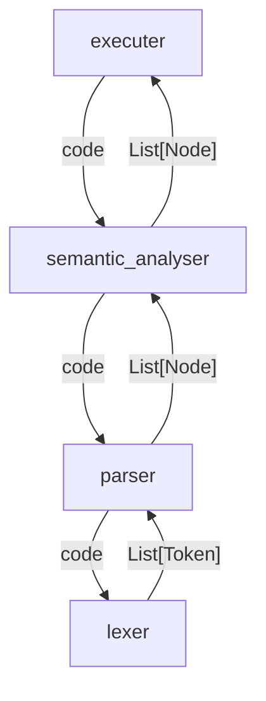

# eml-interpreter

自制eml（exp minus ln）解释器

# 架构

|         文本          |  含义   |       备注       |
|:-------------------:|:-----:|:--------------:|
|       `code`        | 代码文本  |                |
|       `Token`       |  词元   |                |
|       `Node`        | AST节点 |                |
|     `executer`      |  执行器  |    *想法细节待定     |
| `semantic_analyser` | 语义分析器 | 检测错误并专有地格式化AST |
|      `parser`       | 语法分析器 |                |
|       `lexer`       | 词法分析器 |                |

调用方式、调用参数类型及返回值类型结构如下：

# TODO

 